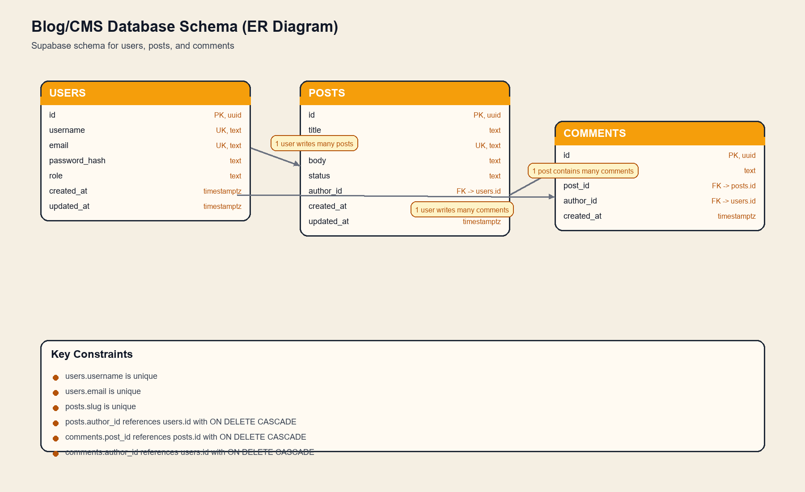

# Blog CMS - Week 3

A full-stack blog platform with posts, comments, and user authentication.

## Tech Stack

- **Backend**: Node.js, Express, Supabase, JWT, bcrypt
- **Frontend**: React + Vite, React Router, Axios

## Setup

### 1. Prerequisites

- Node.js 18+
- A Supabase project

### 2. Install dependencies

```bash
npm run install:all
```

### 3. Configure environment variables

Create these files:

```bash
backend/.env
frontend/.env
```

Use the example values from:

- `backend/.env.example`
- `frontend/.env.example`

### 4. Configure Supabase

In the Supabase SQL Editor, run:

- `backend/supabase/schema.sql`

Then set these backend variables:

```env
SUPABASE_URL=https://your-project-ref.supabase.co
SUPABASE_SERVICE_ROLE_KEY=your-service-role-key
JWT_SECRET=change-this-to-a-long-random-secret
JWT_EXPIRES_IN=7d
PORT=5000
NODE_ENV=development
```

### 5. Seed the database

```bash
cd backend
npm run seed
```

### 6. Run the app

```bash
npm run dev
```

- Backend: http://localhost:5000
- Frontend: http://localhost:5173

## API Endpoints

| Method | Route | Auth | Description |
|--------|-------|------|-------------|
| POST | /api/auth/signup | No | Register new user |
| POST | /api/auth/login | No | Login and get JWT |
| GET | /api/auth/me | Yes | Get current user |
| GET | /api/posts | No | List published posts |
| GET | /api/posts/:slug | No | Get single post with comments |
| GET | /api/posts/me | Yes | List current user's posts |
| POST | /api/posts | Yes | Create post |
| PUT | /api/posts/:id | Yes | Update post |
| DELETE | /api/posts/:id | Yes | Delete post |
| POST | /api/comments | Yes | Add comment |
| DELETE | /api/comments/:id | Yes | Delete comment |

## Database Diagram


<!-- 
- PNG file: [docs/database-schema-diagram.png](docs/database-schema-diagram.png) -->
<!--  -->

## Project Structure

```text
blog-cms/
|-- backend/
|   |-- src/
|   |   |-- controllers/  # Route handlers
|   |   |-- middleware/   # Auth, error, validation
|   |   |-- routes/       # Express routers
|   |   |-- services/     # Business logic + Supabase queries
|   |   `-- utils/        # Helpers (slugify, supabase client)
|   `-- supabase/
|       |-- schema.sql    # Tables, constraints, triggers
|       `-- seed.js       # Sample data
`-- frontend/
    `-- src/
        |-- components/
        |-- context/
        |-- hooks/
        |-- pages/
        |-- services/
        `-- styles/
```
