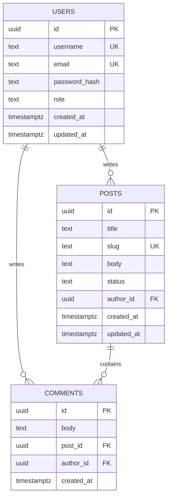

# Database Schema Diagram

This ER diagram reflects the current Supabase database structure used by the backend.

## Relationship Summary

- One `user` can create many `posts`.
- One `user` can create many `comments`.
- One `post` can have many `comments`.
- Each `comment` belongs to exactly one `post` and one `user`.

## Constraints

- `users.username` is unique.
- `users.email` is unique.
- `posts.slug` is unique.
- `posts.author_id` references `users.id`.
- `comments.post_id` references `posts.id`.
- `comments.author_id` references `users.id`.
